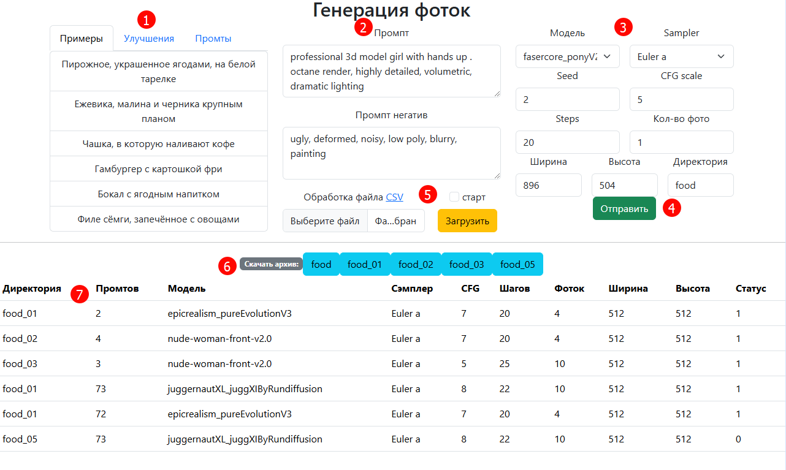
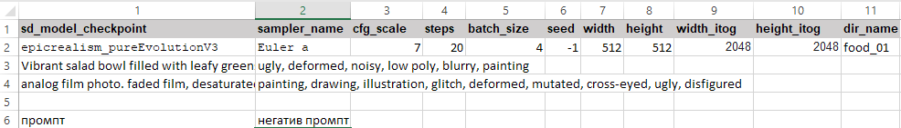
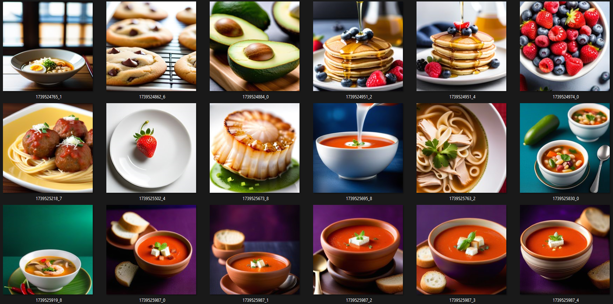

# Генератор картинок от Stable Diffusion

Веб интерфейс для генерирования картинок, упрощенный. В основном делался для потоковой обработки запросов к Stable Diffusion.

## Требования

* Докер на машине
* Установленный Stable Diffusion с доступным API по порту, необходимо в скриптах указать ИП и порт
* Установленный в Stable Diffusion [adetailer](https://github.com/Bing-su/adetailer)

## Установка

* Запустить `docker compose up -d`
* Перейти по адресу `127.0.0.1:8084`
* Использовать

## Использование

1 - Панель с предустановленными настройками промптов. Примеры - вставляют готовый промпт. Улучшения - добавляют в промпт текст. Промпты - вставляют заготовки в промпт и негативный промпт (необходимо заменять {prompt} на фразы)

2 - Промпт для Stable Diffusion

3 - Настройки Stable Diffusion, Директория - куда сохранять фотографии

4 - Кнопка для получения фото по указанному промпту(2) и настройкам(3)

5 - Панель для загрузки файла CSV, который обрабатывается в фоне.

В файле во второй строке указываются настройки, начиная с третьей строки и ниже, можно указывать промпт и негативный промпт. На каждый промпт будет генерироваться фотография (количество можно устанавливать в поле batch_size, вторая строка - конфиг для всех промптов!) Фотографии будут сохраняться в папку с именем указанным в поле dir_name.

6 - Панель для отображения директорий с фотками - по нажатию получаем zip архив!

7 - Панель для отображения процесса обработки файлов CSV (Статус=0 - в обработке, 1-готов)

Результат работы скрипта, содержимое архива, имена файлов временные метки с подчеркиванием и номером batch_size для промпта
